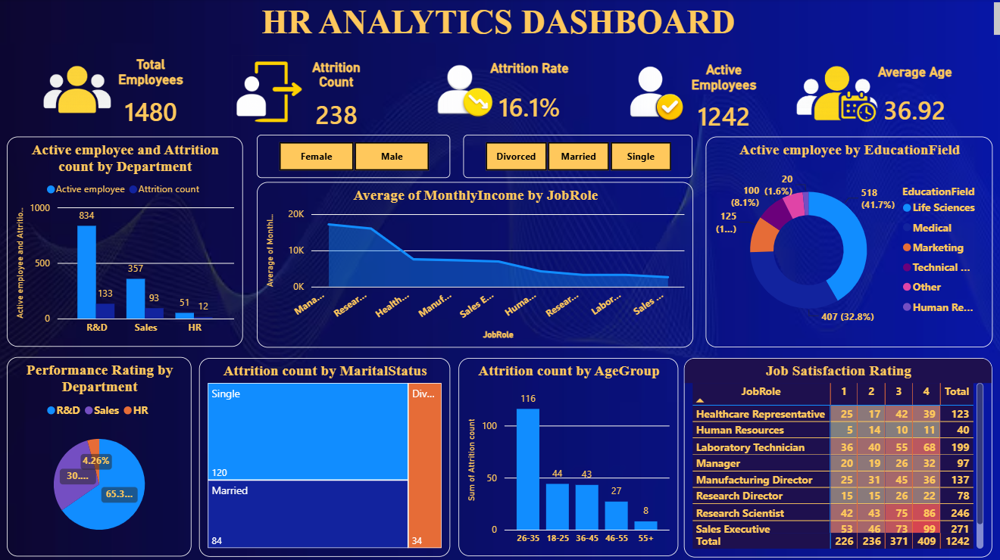

# HR Analytics Dashboard

## Project Overview
An interactive Power BI dashboard designed to analyze employee attrition, workforce demographics, and job satisfaction to support HR decision-making.

## Features
- Total Employees, Active Employees, and Attrition Count
- Attrition Rate Analysis
- Department-wise Attrition Analysis
- Employee Distribution by Education Field
- Average Monthly Income by Job Role
- Attrition Analysis by Marital Status and Age Group
- Job Satisfaction Rating by Role
- Interactive Filters for Gender and Marital Status

## Tools & Technologies
- Power BI
- DAX
- Data Modeling
- Data Visualization

## Dashboard Preview

## Key Insights
- Total Employees: 1,480
- Attrition Count: 238
- Attrition Rate: 16.1%
- Active Employees: 1,242
- Average Employee Age: 36.92 years

## Files Included
- `HR_Analytics.pbix` – Power BI dashboard file
- `Dashboard.png` – Dashboard screenshot
- `README.md` – Project documentation

## Author
**Dilin EV**
